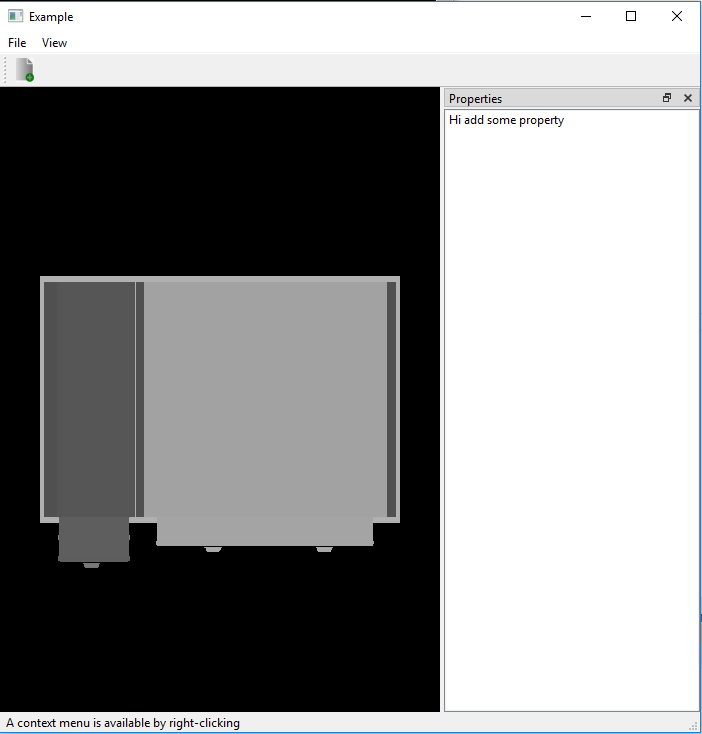

# 07_ply_reader

Render the .ply model using glDrawElements:
  1) PLYreader class read binary and ascii format
  2) Did manual scaling in vertex shader like in stl reader project
  3) Picture show rendering of ply model of table
 
  
  
Output Image:

References:
1)Greg Turk
  reference: http://gamma.cs.unc.edu/POWERPLANT/papers/ply.pdf
2)for reading the binary format
  reference; https://medium.com/@elope139/reading-ply-files-that-are-in-binary-format-cab3a37276a2
